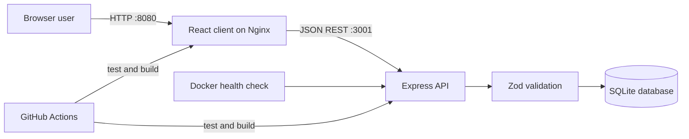

# PasteBin - Full Stack & DevOps Challenge

A production-minded snippet sharing platform with a React client, REST API, persistent SQLite storage, automated tests, containerized local deployment, health checks, structured request logging, and CI.

## Features

- Create text or code pastes with a title, language, and visibility
- Search and list saved pastes
- Open a paste, track views, copy content, share its link, and delete it
- Persistent SQLite database with indexes and WAL mode
- Input validation and consistent JSON errors
- OpenAPI specification and human-readable API documentation
- Responsive React + TypeScript interface
- Docker Compose with persistent volume and health checks
- API integration tests and GitHub Actions CI

## Architecture



The client and API are independently deployable. SQLite data lives in a Docker volume, so container replacement does not remove pastes.

## Quick start

Requirements: Node.js 20+ and npm.

```bash
cp .env.example .env
npm install
npm run dev
```

Open:

- Web client: http://localhost:5173
- API: http://localhost:3001
- API documentation: http://localhost:3001/api-docs
- OpenAPI JSON: http://localhost:3001/openapi.json
- Health check: http://localhost:3001/health

## Run with Docker

```bash
docker compose up --build
```

Open the app at http://localhost:8080. The API remains available at http://localhost:3001. Stop it with `docker compose down`. Add `-v` only if you intentionally want to delete the database volume.

## API

| Method | Route | Purpose |
|---|---|---|
| `GET` | `/health` | Service health |
| `GET` | `/api/pastes?search=react&limit=50` | List/search pastes |
| `POST` | `/api/pastes` | Create a paste |
| `GET` | `/api/pastes/:id` | Retrieve a paste and increment views |
| `DELETE` | `/api/pastes/:id` | Delete a paste |
| `GET` | `/api/stats` | Aggregate dashboard statistics |

Create example:

```bash
curl -X POST http://localhost:3001/api/pastes \
  -H "Content-Type: application/json" \
  -d '{"title":"Hello world","content":"console.log(\"hello\")","language":"JavaScript","visibility":"public"}'
```

Validation limits titles to 120 characters and paste content to 100,000 characters. Visibility must be `public`, `unlisted`, or `private`.

## Testing

```bash
npm test
npm run build
```

The integration suite runs against an isolated in-memory SQLite database and verifies create, list, retrieve, delete, validation, and health behavior.

## Configuration

| Variable | Default | Description |
|---|---|---|
| `PORT` | `3001` | API port |
| `DATABASE_PATH` | `./data/pastebin.db` | SQLite file |
| `CORS_ORIGIN` | `http://localhost:5173` | Comma-separated allowed client origins |
| `VITE_API_URL` | `http://localhost:3001` | Public API URL used by the client |

Do not commit `.env`; `.env.example` documents safe defaults.

## Design decisions

- **SQLite** keeps setup small while providing transactional persistence and a clean migration path to PostgreSQL.
- **Express** provides a focused HTTP boundary; **Zod** validates untrusted input before database writes.
- **Opaque Nano IDs** are short enough to share but difficult to enumerate sequentially.
- **Separate web/API containers** mirror a real deployment and let each tier scale or ship independently.
- Authentication is intentionally outside the minimum scope. The visibility field models future authorization behavior; production private-paste enforcement would require accounts and ownership checks.

## Repository layout

```text
src/                 React client
server/              API, database layer, and integration tests
.github/workflows/   CI pipeline
Dockerfile.*         Web and API images
docker-compose.yml   Local production-like stack
```
