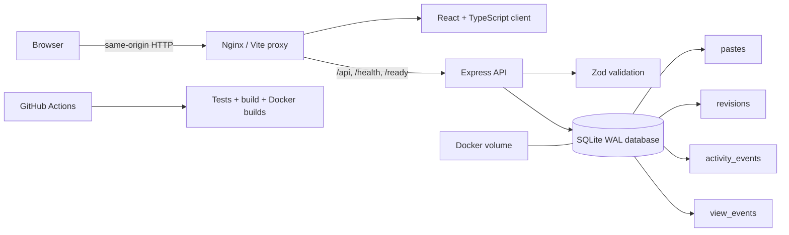

# PasteBin


PasteBin is a production-minded, full-stack snippet platform built for a Full Stack & DevOps evaluation. It combines a responsive React developer workspace with a documented Express REST API, versioned SQLite persistence, real analytics, secure one-time secrets, automated tests, containers, health checks, structured logs, and CI.

## 60-second quick start

Requirements: Node.js 20+ and npm.

```bash
git clone https://github.com/gayathrisathishkumarr/PasteBin.git
cd PasteBin
cp .env.example .env
npm install
npm run dev
```

Open the Vite URL printed in the terminal, normally <http://localhost:5173>. The API and documentation are available through the same origin, so the app remains connected if Vite selects another port.

## Challenge requirements

| Requirement | PasteBin implementation |
|---|---|
| Persistent paste storage | SQLite database with WAL mode, foreign keys, indexes, schema versioning, and a persistent Docker volume |
| Create, retrieve, list, search, edit, and delete | Validated REST endpoints plus complete responsive web workflows |
| Favorite and fork/remix | Persisted favorite state, source attribution, and transactional fork counters |
| Share and download | Stable direct URLs, clipboard feedback, client-side QR codes, raw-text endpoint, and safe source filenames |
| Public and unlisted visibility | Public Explore scope; unlisted records are excluded from public queries and available only through direct URLs |
| Expiration and burn after reading | Consistent expired responses, query exclusion, cleanup job, warning UI, and atomic one-time retrieval |
| Version history | Immutable revision snapshots, readable comparisons, and restore-as-new-version behavior |
| Filtering, sorting, and pagination | Parameterized search/filter queries, allowlisted sort modes, URL-persisted client filters, and paginated results |
| Import and export | Validated JSON preview/import and single or bulk JSON/source export |
| Analytics and activity | Aggregates and time-series values derived only from stored pastes, view events, and activity events |
| Documented REST API | Machine-readable OpenAPI JSON, human-readable API docs, and an in-app safe GET playground |
| Responsive web client | React, TypeScript, Vite, accessible dialogs/forms, mobile navigation, loading skeletons, and error recovery |
| Security | Zod validation, parameterized SQL, CORS configuration, body limits, rate limiting, security headers, and safe error envelopes |
| Logging and observability | Structured request logs, correlation IDs, durations, `/health`, `/ready`, and non-sensitive `/metrics` |
| Docker and Compose | Separate API/web images, Nginx same-origin proxy, health checks, startup ordering, and named SQLite volume |
| Automated testing | Vitest/Supertest coverage for core and advanced API behavior plus upload-type unit tests |
| CI/CD | GitHub Actions runs locked install, tests, production build, Compose validation, and both Docker image builds |
| Environment configuration | Documented `.env.example` for ports, database path, CORS, rate limiting, body size, and API origin |
| Submission documentation | Architecture diagram, endpoint catalog, setup, security rationale, deployment guidance, tradeoffs, and evaluator guide |

## Product highlights

- Create, retrieve, search, filter, sort, paginate, edit, favorite, fork, share, download, export, import, and delete pastes
- **Code Lineage Map** that connects forks, revisions, and structurally similar snippets with an explainable, deterministic comparison—no AI service or source-code upload
- Public, direct-link unlisted, expiring, and atomically consumed burn-after-reading secret pastes
- Stable refresh-safe URLs, raw-text downloads, client-side QR sharing, copy feedback, and distraction-free reading
- Revision history on every edit, restoration as a new version, source attribution, and fork counts
- Rich paste studio with templates, line numbers, tab indentation, draft autosave/recovery, preview/raw modes, fullscreen editing, drag/drop, file detection, counters, expiration presets, and `Ctrl/Cmd + S`
- URL-persisted library filters, grid/list layouts, bulk export/delete, public Explore, Favorites, real Analytics, local Settings, command palette, and API Playground
- No accounts, fake users, fabricated trends, simulated activity, unfinished notifications, or billing UI

## Architecture



The browser uses same-origin URLs in development and production. Vite proxies API traffic to port `3001`; production Nginx routes the same paths to the API container. This avoids hard-coded browser ports and CORS surprises.

## Technology choices

- **React 18 + TypeScript + Vite** for a fast, strongly typed client without a heavy framework runtime
- **Tailwind CSS + Lucide** for an accessible, responsive design system; **qrcode** generates QR images entirely in the browser
- **Express 5 + Zod** for a compact HTTP boundary with centralized validation and predictable errors
- **better-sqlite3** for transactional, parameterized, low-operations persistence with WAL, foreign keys, indexes, and atomic secret retrieval
- **Vitest + Supertest** for isolated API integration tests
- **Nginx + Docker Compose** for a production-like same-origin deployment and persistent database volume

## Database and migrations

Schema version `2` is managed through SQLite `PRAGMA user_version`. Migration runs in a transaction:

1. Detect the legacy schema.
2. Rename the old `pastes` table.
3. Create the expanded table and copy every existing row.
4. Map legacy `private` labels to truthful `unlisted` visibility.
5. Create `revisions`, `activity_events`, and `view_events`, plus indexes.
6. Drop the legacy table and commit the schema version.

No existing paste content, IDs, timestamps, or view counts are discarded. Foreign keys use safe cascade or `SET NULL` behavior. SQLite WAL and a five-second busy timeout improve concurrent reliability.

| Table | Purpose |
|---|---|
| `pastes` | Current paste state, metadata, expiration, favorite, source, counts, and version |
| `revisions` | Immutable snapshots saved before edits/restores |
| `activity_events` | Genuine create/edit/favorite/fork/import/delete/burn events |
| `view_events` | Timestamped view events for time-series analytics |

Expired records become unavailable immediately and are excluded from normal queries. A lightweight hourly cleanup removes records that have been expired for seven days, retaining a short analytics window.

## REST API

Machine-readable specification: [`/openapi.json`](http://localhost:3001/openapi.json)

Human-readable documentation: [`/api-docs`](http://localhost:3001/api-docs)

| Method | Route | Purpose |
|---|---|---|
| `GET` | `/health` | Liveness, timestamp, uptime |
| `GET` | `/ready` | Database readiness |
| `GET` | `/metrics` | Safe request/error/paste/uptime metrics |
| `GET` | `/api/pastes` | Search, filter, sort, scope, and paginate |
| `POST` | `/api/pastes` | Create a paste |
| `GET` | `/api/pastes/:id/meta` | Non-consuming metadata for secret warning |
| `GET` | `/api/pastes/:id` | Retrieve and count a view; atomically burn secrets |
| `PUT` | `/api/pastes/:id` | Edit and create a revision |
| `DELETE` | `/api/pastes/:id` | Delete paste and revisions |
| `PATCH` | `/api/pastes/:id/favorite` | Persist favorite state |
| `POST` | `/api/pastes/:id/fork` | Remix a public paste |
| `GET` | `/api/pastes/:id/raw` | Plain-text view; `?download=1` adds a safe filename |
| `GET` | `/api/pastes/:id/revisions` | List current and historical versions |
| `POST` | `/api/pastes/:id/revisions/:version/restore` | Restore as a new version |
| `GET` | `/api/lineage` | Map forks, versions, and code-similarity relationships |
| `GET` | `/api/pastes/:id/related` | Explain related snippets and similarity scores |
| `GET` | `/api/activity` | Recent real activity |
| `GET` | `/api/analytics` | Real aggregate and time-series analytics |
| `POST` | `/api/export` | Export selected IDs as JSON |
| `POST` | `/api/import` | Validate and import up to 50 pastes |

List parameters: `search`, `scope=mine|public|favorites`, `language`, `visibility`, `tag`, `favorite=true`, `sort=newest|oldest|views|forks|title|size|trending`, `page`, and `limit`.

Errors consistently use:

```json
{
  "error": { "code": "VALIDATION_ERROR", "message": "Paste validation failed", "details": {} },
  "requestId": "request-correlation-id"
}
```

### curl examples

Create a paste:

```bash
curl -X POST http://localhost:3001/api/pastes \
  -H "Content-Type: application/json" \
  -d '{
    "title": "Hello Java",
    "description": "Minimal Java entry point",
    "content": "public class Main { public static void main(String[] args) { System.out.println(\"Hello\"); } }",
    "language": "Java",
    "visibility": "public",
    "tags": ["java", "example"]
  }'
```

List or search pastes:

```bash
curl "http://localhost:3001/api/pastes?search=java&sort=newest&page=1&limit=10"
```

Retrieve a paste using the `id` returned by creation:

```bash
curl http://localhost:3001/api/pastes/PASTE_ID
```

Delete a paste:

```bash
curl -X DELETE http://localhost:3001/api/pastes/PASTE_ID
```

## Local development

Requirements: Node.js 20+, npm.

```bash
cp .env.example .env
npm install
npm run dev
```

Open the Vite URL printed in the terminal (normally <http://localhost:5173>). The client remains connected if Vite selects `5174` because requests use the development proxy.

## Docker

```bash
docker compose up --build
```

Open <http://localhost:8080>. Nginx serves the SPA and proxies API traffic. SQLite lives in the named `paste_data` volume, so container replacement preserves data.

```bash
docker compose down
# Use `docker compose down -v` only when intentionally deleting persisted data.
```

## Environment

| Variable | Default | Description |
|---|---|---|
| `PORT` | `3001` | API listener |
| `DATABASE_PATH` | `./data/pastebin.db` | SQLite path |
| `CORS_ORIGIN` | localhost development/production origins | Comma-separated browser origins |
| `RATE_LIMIT_MAX` | `300` | Per-IP API requests per minute |
| `BODY_LIMIT` | `150kb` | Express JSON body limit |
| `VITE_API_URL` | blank | Optional external API origin; blank enables same-origin proxying |

Never commit `.env` or credentials. PasteBin requires no paid service or external account.

## Testing and CI

```bash
npm test
npm run build
docker compose config
```

The API suite runs against fresh in-memory databases and covers create, retrieve, list, search, filter, sort, pagination, update, favorite, fork, version history, restore, public visibility, expiration, concurrent/repeated secret retrieval, raw downloads, import/export, validation, rate limiting, delete, health, readiness, and metrics.

GitHub Actions installs locked dependencies, runs tests and the production build, validates Compose, and builds both Docker images.

## Security decisions

- Zod validates request bodies, enum values, metadata lengths, tags, import batches, and expiration
- Every SQL value is parameterized; sort columns are selected from an allowlist
- Public queries explicitly exclude unlisted, secret, and expired records
- Secret retrieval uses one synchronous SQLite transaction: one request receives content, later/concurrent requests receive `404`
- Raw downloads normalize and restrict filenames
- Per-IP rate limiting, bounded JSON bodies, controlled CORS, request IDs, and security headers are enabled
- Logs are structured JSON with request ID, status, duration, method, and path; stack traces are not returned
- `/metrics` contains only non-sensitive aggregate operational values
- Graceful SIGINT/SIGTERM shutdown drains HTTP, closes SQLite, and has a bounded fallback

Account ownership is intentionally out of scope; therefore nothing is described as private. An authenticated multi-user deployment would need ownership and authorization before exposing My Pastes as a personal concept.

## Production deployment

Build and publish the two Docker images, attach persistent storage at `/app/data`, terminate TLS at a load balancer or ingress, set `CORS_ORIGIN` to the production web origin, and back up the SQLite volume. For a single-node evaluator deployment, Compose is sufficient. For multi-node horizontal API scaling, migrate persistence to PostgreSQL and use a shared rate-limit store.

## Tradeoffs and future improvements

- Syntax presentation is dependency-light and line-numbered; a future iteration could add a worker-based parser such as Shiki for richer highlighting.
- Favorites and “My Pastes” are workspace-wide because authentication is deliberately absent.
- Trending is a transparent score from persisted views, forks, favorites, and recency ordering—not a fabricated percentage.
- SQLite is ideal for this single-node challenge; PostgreSQL is the natural scale-out path.
- A larger production team would add Playwright visual regression and axe accessibility checks to the existing integration suite.

## Evaluator demo checklist

1. Create a tagged public paste from a template; refresh to demonstrate direct URL stability.
2. Edit it twice, inspect history, and restore version 1.
3. Favorite, fork, copy, QR-share, raw-view, and download it.
4. Filter/sort My Pastes, then export a selection and import the JSON.
5. Open Explore and verify only public active content appears.
6. Create a short-lived paste and observe the expired `410` behavior.
7. Create a secret, accept the warning, then verify the same URL is unavailable.
8. Inspect real Dashboard activity, language bars, health indicators, and Analytics.
9. Use `Ctrl/Cmd + K`, change local Settings, and test a safe GET in API Playground.
10. Run `npm test`, `npm run build`, and `docker compose config`.
